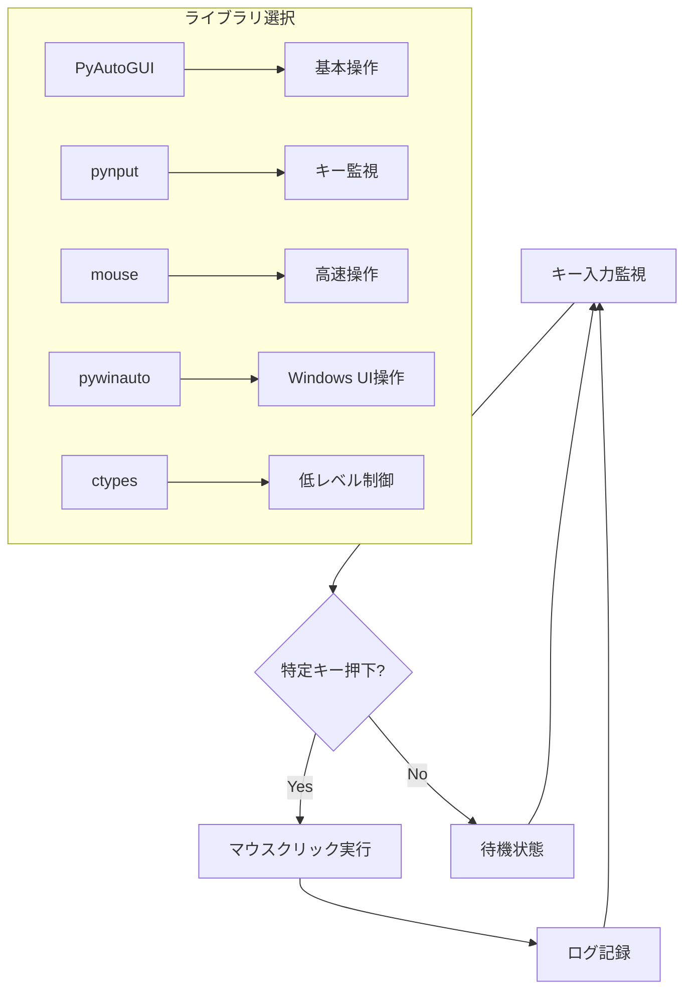

# マウスコントローラ設計書

## 概要
特定のキー入力に応じてマウスクリックを実行する自動化ツール

## アーキテクチャ

## 機能要件
1. キー入力監視機能
2. マウスクリック実行機能
3. ライブラリフォールバック機構
4. 設定ファイル管理
5. 操作ログ記録

## 非機能要件
1. クロスプラットフォーム対応
2. 設定変更の即時反映
3. エラーハンドリング
4. パフォーマンス監視
